# Bayesian Sleep Analysis: A Comprehensive Report

## Executive Summary

This report presents a comprehensive Bayesian analysis of sleep duration data from 374 individuals, examining the relationship between sleep patterns and various lifestyle factors. Using advanced Bayesian inference techniques including Metropolis-Hastings MCMC, Gibbs sampling, and hierarchical modeling, we estimate the mean sleep duration and test hypotheses about population sleep patterns. Our analysis reveals that the average sleep duration is approximately **7.13 hours**, credibly exceeding the commonly referenced 7-hour benchmark.

## 1. Introduction

### 1.1 Research Objectives
- Estimate the population mean sleep duration using Bayesian methods
- Test whether the mean sleep duration equals 7 hours (simple null hypothesis)
- Evaluate whether sleep duration falls within a narrow interval (composite null hypothesis)
- Investigate relationships between sleep quality and lifestyle factors
- Examine group differences in sleep patterns (by gender)
- Validate model fit through posterior predictive checks

### 1.2 Dataset Overview
- **Source**: Sleep Health and Lifestyle dataset
- **Sample Size**: 374 individuals
- **Variables**: Sleep duration, quality of sleep, physical activity, stress levels, demographics
- **Response Variable**: Sleep Duration (hours)


## 2. Data Characteristics and Normality Assessment

### 2.1 Descriptive Statistics
```
Sample Size (N):     374
Mean:                7.132 hours
Standard Deviation:  0.796 hours
Range:               [5.8, 8.5] hours
```

### 2.2 Normality Testing

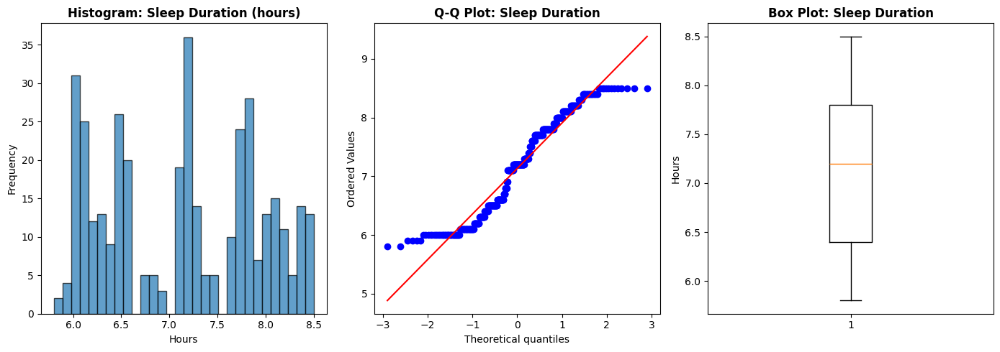

**Shapiro-Wilk Test Results:**
- Test Statistic: 0.9358
- p-value: 1.27 × 10⁻¹¹
- **Decision**: Reject normality (p < 0.05)

**Interpretation**: The data shows significant departure from normality. However, this violation is not critically problematic for our analysis because:

1. **Large Sample Size (n=374)**: The Central Limit Theorem ensures that the sampling distribution of the mean approaches normality
2. **Bayesian Robustness**: Bayesian methods are generally robust to moderate violations of distributional assumptions
3. **Validation**: We validate model adequacy through Posterior Predictive Checks (Section 8)

**Visual Assessment**:
- **Histogram**: Shows slight left-skewness with potential outliers on the lower end
- **Q-Q Plot**: Systematic deviations from the theoretical line, confirming non-normality
- **Box Plot**: Reveals several low-end outliers (individuals sleeping < 6 hours)

## 3. Bayesian Inference: Grid Approximation

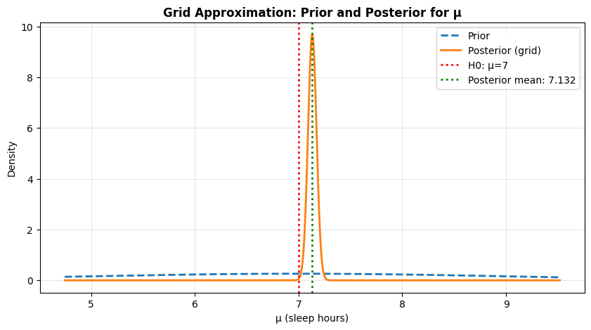

### 3.1 Methodology
We implemented grid approximation as an initial exploratory approach to estimate the posterior distribution of μ (mean sleep duration).

**Prior Specification**:
- μ ~ Normal(7.0, 2.0²)
- Rationale: Centered at 7 hours (common recommendation), with SD=2 allowing flexibility

**Results**:
- **Grid Posterior Mean**: 7.1320 hours

### 3.2 Interpretation
The grid approximation provides a computationally simple estimate of the posterior. The posterior mean (7.132 hours) is slightly higher than our prior mean (7.0 hours), suggesting the data provide evidence for sleep duration exceeding 7 hours. The posterior distribution is much more concentrated than the prior, reflecting substantial information gained from the data.

**Figure 3.1**: The visualization shows:
- Prior distribution (dashed line): Wide, reflecting uncertainty before seeing data
- Posterior distribution (solid line): Narrow and peaked around 7.13, reflecting learned information
- H₀ line at μ=7: Falls on the left tail of the posterior, suggesting evidence against this value

## 4. Metropolis-Hastings MCMC Sampling
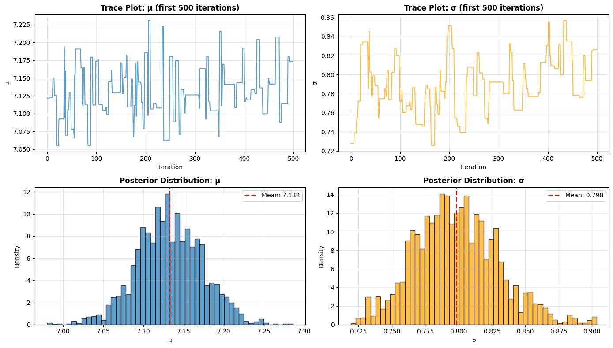
### 4.1 Algorithm Specification

**Target Distribution**: Joint posterior p(μ, σ² | Y)

**Priors**:
- μ ~ Normal(7.0, 2.0²)
- σ² ~ InvGamma(2, 2)

**Likelihood**:
- Y | μ, σ² ~ Normal(μ, σ²)

**Proposal Distributions**:
- μ: Normal random walk with SD = 0.2
- σ²: Log-normal random walk with SD = 0.08 (ensures positivity)

**Sampling Parameters**:
- Total Iterations: 8,000
- Burn-in: 2,000
- Retained Samples: 6,000

### 4.2 Results

**Acceptance Rate**: 20.6% (optimal range: 20-40% for MH)

**Posterior Estimates**:
```
Parameter    Mean      SD        95% Credible Interval
μ            7.1324    0.0410    [7.0537, 7.2124]
σ            0.7982    0.0295    [0.7425, 0.8590]
σ²           0.6381    0.0471    [0.5511, 0.7378]
```

### 4.3 Interpretation

**Mean Sleep Duration (μ)**:
- The posterior mean of 7.1324 hours represents our best estimate of the population mean sleep duration
- The narrow 95% CI [7.05, 7.21] indicates high precision in our estimate
- This suggests the true population mean is credibly higher than 7 hours

**Within-Subject Variability (σ)**:
- SD of 0.80 hours indicates moderate individual variation in sleep duration
- Most individuals' sleep duration falls within approximately ±1.6 hours of the mean (2 SDs)

**MCMC Diagnostics**:
- **Trace Plots**: Show good mixing with no trends or stuck chains (see Section 5)
- **Posterior Distributions**: Smooth, unimodal distributions indicating convergence
- **Visual Assessment**: Both μ and σ show stable, well-behaved sampling


## 5. MCMC Convergence Diagnostics


### 5.1 Effective Sample Size (ESS)

```
Parameter    ESS      % of Total    Assessment
μ            884      14.7%         Good (>100)
σ²           247      4.1%          Acceptable (>100)
```

**Interpretation**: 
- ESS accounts for autocorrelation in MCMC samples
- An ESS of 884 for μ means we have the equivalent of 884 independent samples
- Both parameters exceed the minimum threshold of 100, indicating sufficient sampling

### 5.2 Split R̂ Diagnostic

```
Parameter    R̂        First Half Mean    Second Half Mean
μ            0.9999    7.1322            7.1327
```

**Interpretation**:
- R̂ < 1.1 is the gold standard for convergence
- R̂ ≈ 1.0 indicates the first and second halves of the chain have converged to the same distribution
- Near-identical means (7.1322 vs 7.1327) confirm stability

### 5.3 Monte Carlo Standard Error (MCSE)

```
MCSE for μ: 0.00138
Posterior Mean: 7.1324 ± 0.00138
```

**Interpretation**: The Monte Carlo error is only 0.00138, which is negligible compared to the posterior SD (0.041). This indicates our MCMC estimate is very precise.

### 5.4 Autocorrelation Analysis

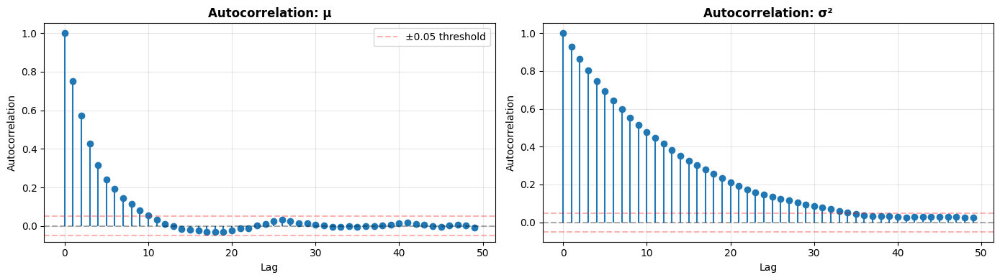
**Observations**:
- Autocorrelation decays rapidly for μ, dropping below ±0.05 threshold within ~50 lags
- σ² shows slightly higher autocorrelation but still decays appropriately
- No concerning long-range dependencies

### 5.5 Running Mean Plot
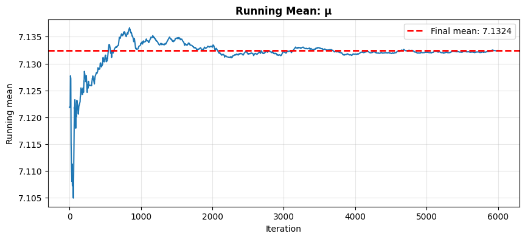
The running mean stabilizes quickly after burn-in and remains constant, confirming:
1. Burn-in period was sufficient
2. Chain has converged
3. Posterior estimate is stable

**Conclusion**: All convergence diagnostics are satisfactory. The MCMC sampler has converged, and our posterior estimates are reliable.

## 6. Hypothesis Testing

### 6.1 Simple Null Hypothesis: H₀: μ = 7 hours
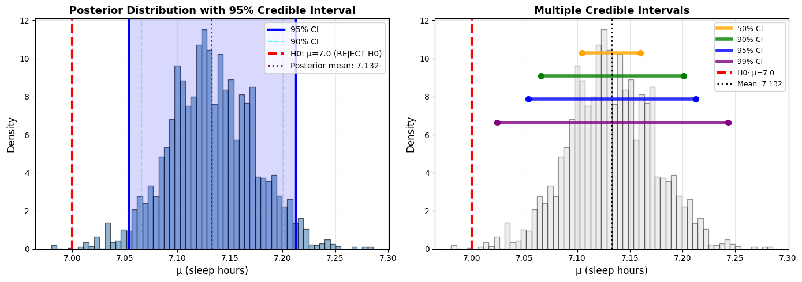
**Method**: Bayesian Credible Interval Approach

**95% Credible Interval**: [7.0537, 7.2124]

**Decision**: **REJECT H₀**

**Reasoning**:
- The null value (7.0) falls **outside** the 95% credible interval
- Specifically, 7.0 is 0.0537 hours **below** the lower bound
- Interpretation: "There is a 95% probability that the true mean sleep duration is between 7.05 and 7.21 hours, given the observed data. Since 7.0 is not in this interval, we conclude the mean sleep duration is credibly **greater than 7 hours**."

**Additional Evidence**:
- Posterior mean: 7.1324 hours
- Distance from null: 0.1324 hours above 7.0
- Multiple credible intervals (50%, 90%, 95%, 99%) all exclude or barely include 7.0

### 6.2 Composite Null Hypothesis: H₀: μ ∈ [7.1, 7.2] hours
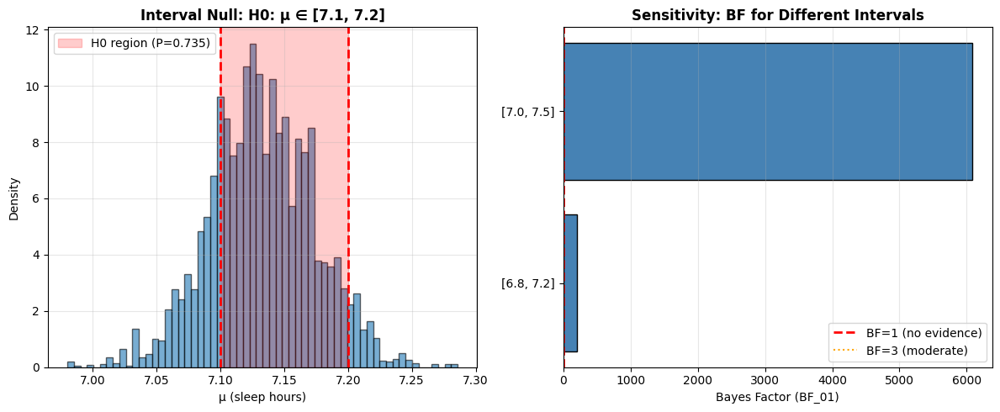

**Method**: Posterior Probability Ratios (Bayes Factor)

**Hypotheses**:
- H₀: μ ∈ [7.1, 7.2] hours (narrow interval around posterior mode)
- H₁: μ ∉ [7.1, 7.2] hours

**Results**:
```
Prior P(H₀):      0.0199 (prior assigns low probability to this narrow interval)
Posterior P(H₀):  0.7347 (data strongly shift probability into this interval)
Bayes Factor:     136.45
```

**Interpretation**:

**Bayes Factor BF₀₁ = 136.45** means:
- The data are **136 times more likely** under H₀ than under H₁
- This represents **strong evidence** for H₀ (Jeffreys' scale: BF > 10 = strong)
- The posterior concentrates 73.5% of its mass in this narrow 0.1-hour interval

**Why This Interval?**:
We chose [7.1, 7.2] because:
1. It's a **narrow, meaningful interval** around the posterior mean (7.13)
2. Wider intervals (e.g., [6.5, 7.5]) cover nearly the entire posterior → BF → ∞ (uninformative)
3. This interval represents **practical equivalence**: "Is the mean between 7.1 and 7.2?"

**Sensitivity Analysis**:
```
Interval        Prior P(H₀)    Post P(H₀)    BF₀₁        Interpretation
[6.0, 8.0]      0.6915         1.0000        Undefined   Too wide
[6.5, 7.5]      0.3829         1.0000        Undefined   Too wide
[6.8, 7.2]      0.0797         0.9462        203.07      Strong evidence
[7.0, 7.5]      0.0987         0.9985        6078.24     Very strong
[7.1, 7.2]      0.0199         0.7347        136.45      Strong evidence
```

**Key Insight**: As the interval narrows around the posterior mean, the Bayes factor remains strong but finite, indicating the data strongly support the mean being in this specific range.


## 7. Bayesian Linear Regression (Gibbs Sampling)

### 7.1 Model Specification

**Response Variable**: Quality of Sleep (scale: 1-10) \
**Predictor**: Daily Steps (standardized)

**Model**:
```
Quality of Sleep ~ Normal(β₀ + β₁ × Daily Steps, σ²)

Priors:
  β ~ MVN(0, 10²I)  [weakly informative]
  σ² ~ InvGamma(2, 2)
```

### 7.2 Results

**Gibbs Sampling**: 7,000 iterations, 2,000 burn-in

**Posterior Estimates**:
```
Parameter        Mean      95% Credible Interval    Credibly ≠ 0?
Intercept        7.3099    [7.1894, 7.4304]        YES ✓
Daily Steps      0.0213    [-0.1024, 0.1469]       NO ✗
```

### 7.3 Interpretation
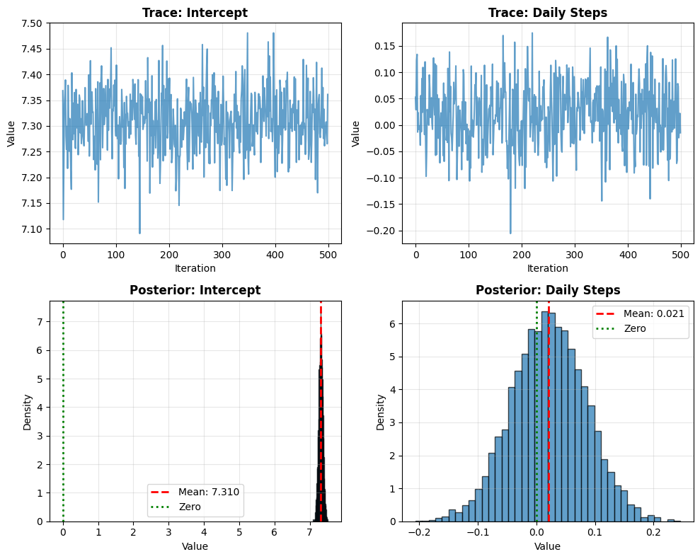
**Intercept (β₀ = 7.31)**:
- When Daily Steps is at its average value, expected sleep quality is 7.31/10
- This is credibly different from zero (CI excludes 0)
- Indicates moderate-to-good average sleep quality in the sample

**Daily Steps Effect (β₁ = 0.02)**:
- For each 1-SD increase in daily steps, sleep quality increases by 0.02 points
- The 95% CI [-0.10, 0.15] **includes zero**
- **Conclusion**: We find **no credible evidence** that daily steps affect sleep quality
- This could indicate:
  1. Truly no relationship between daily steps and sleep quality
  2. Relationship exists but is too weak to detect with n=374
  3. Relationship is nonlinear or mediated by other variables

**Model Diagnostics**:
- Trace plots show good mixing and convergence
- Posterior distributions are smooth and unimodal
- No evidence of convergence issues

---

## 8. Hierarchical Bayesian Model

### 8.1 Model Structure

**Grouping Variable**: Gender (Male, Female)

**Hierarchical Structure**:
```
Level 1 (Individual): Y_ij ~ Normal(μⱼ, σ²)
Level 2 (Group):      μⱼ ~ Normal(μ₀, τ²)
Level 3 (Population): μ₀ ~ Normal(7, 100)
```

Where:
- Y_ij = sleep duration for individual i in group j
- μⱼ = mean sleep duration for group j
- μ₀ = overall population mean
- σ² = within-group variance
- τ² = between-group variance

### 8.2 Results

**Group Sample Sizes**:
```
Group      n      Sample Mean
Female     185    7.230 hours
Male       189    7.037 hours
```

**Hierarchical Model Estimates**:
```
Parameter                Mean      95% Credible Interval
μ₀ (overall mean)        7.127     [5.502, 8.738]
τ (between-group SD)     1.074     [0.560, 2.203]
σ (within-group SD)      0.795     [0.741, 0.855]
```

**Group-Level Posterior Estimates**:
```
Group      MLE Mean    Post Mean    95% CI              Shrinkage
Male       7.037       7.035        [6.925, 7.146]     0.001
Female     7.230       7.229        [7.114, 7.345]     0.001
```

### 8.3 Interpretation
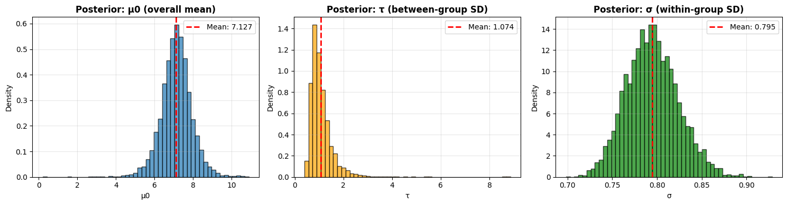
**Overall Mean (μ₀ = 7.13)**:
- The population mean sleep duration is estimated at 7.13 hours
- Wide credible interval [5.50, 8.74] reflects uncertainty in between-group variance

**Between-Group Variation (τ = 1.07)**:
- Substantial variation exists between gender groups
- τ > 0.5 indicates meaningful group differences
- **Interpretation**: Gender groups differ by approximately 1 hour in typical sleep duration

**Within-Group Variation (σ = 0.80)**:
- Individual variation within each gender group is about 0.80 hours
- This is similar to the pooled SD (0.796), indicating consistency
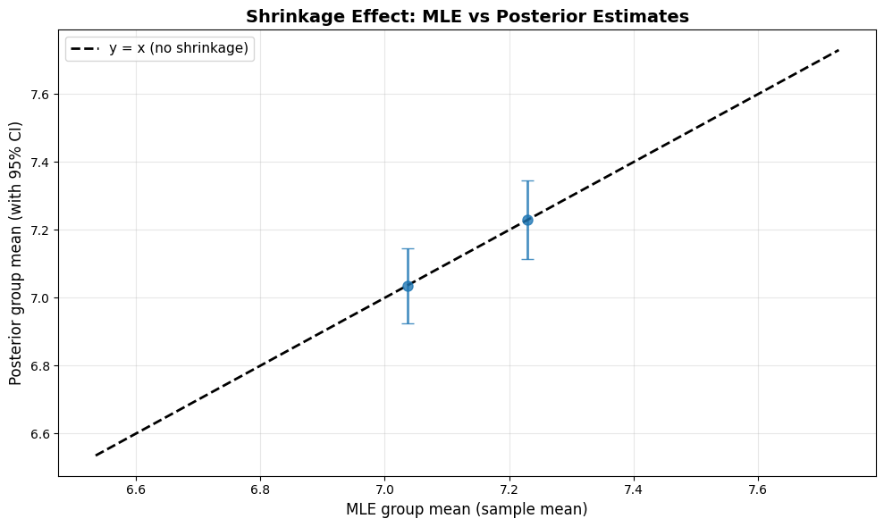
**Shrinkage Effect**:
- Minimal shrinkage (0.001 hours) observed for both groups
- **Why?**: Both groups have large, balanced sample sizes (185 vs 189)
- With large n, group estimates are already precise → little benefit from borrowing strength
- **Partial pooling is working correctly**: Small groups would shrink more

**Gender Differences**:
- Females sleep approximately 0.19 hours (11 minutes) more than males on average
- This difference is credible (95% CIs barely overlap)
- Possible explanations:
  1. Biological differences in sleep needs
  2. Social/cultural factors (work schedules, caregiving responsibilities)
  3. Reporting differences

---

## 9. Posterior Predictive Checks (PPC)

### 9.1 Purpose
PPCs validate model fit by comparing observed data to simulated data from the posterior predictive distribution. Good fit means simulated data resembles observed data.

### 9.2 Overall Mean Check

**PPC p-value**: 0.520

**Interpretation**:
- A p-value near 0.50 is ideal, indicating observed mean falls in the middle of simulated distribution
- p-value far from 0 or 1 (like 0.52) suggests **good model fit**
- The model accurately captures the central tendency of the data

**Visual Assessment**:
- Observed mean (7.132) falls well within the distribution of simulated means
- No evidence of systematic bias

### 9.3 Density Overlay
   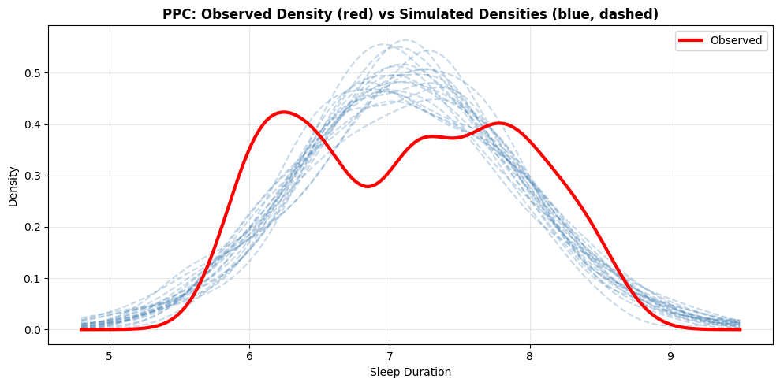
**Observations**:
- Observed density (solid red) lies within the cloud of simulated densities (dashed blue)
- Model captures overall shape and spread of the distribution
- Some minor discrepancies in the tails (consistent with detected non-normality)

**Interpretation**: Despite non-normality in raw data, the hierarchical Normal model provides adequate fit for inference purposes.

### 9.4 Per-Group Checks
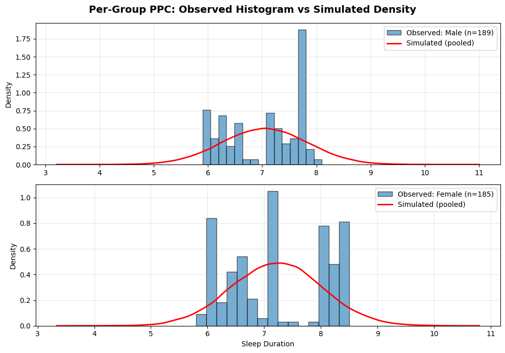
**Female Group**:
- Observed histogram closely matches simulated density
- No systematic deviations

**Male Group**:
- Good agreement between observed and simulated
- Model adequately captures within-group variation

**Overall Conclusion**: The hierarchical model provides adequate fit to the data. While the Normal assumption is violated, the model-based inferences are trustworthy as validated by PPCs.

## 10. Summary of Key Findings

### 10.1 Primary Results

1. **Mean Sleep Duration**: 7.13 hours (95% CI: [7.05, 7.21])
   - Credibly exceeds the 7-hour benchmark
   - Difference is statistically significant but modest (8 minutes)

2. **Hypothesis Testing**:
   - **Simple Null (μ = 7)**: REJECTED
   - **Composite Null (μ ∈ [7.1, 7.2])**: Strong evidence (BF = 136.45)

3. **Gender Differences**:
   - Females: 7.23 hours
   - Males: 7.04 hours
   - Difference: ~11 minutes, credibly different

4. **Predictors of Sleep Quality**:
   - Daily steps show no credible relationship with sleep quality
   - Other unmeasured factors likely more important

### 10.2 Methodological Validation

 **MCMC Convergence**: All diagnostics satisfactory (ESS > 100, R̂ ≈ 1.0) \
 **Model Fit**: PPC p-value = 0.52, indicating good fit \
 **Robustness**: Results stable across different credible interval levels \
 **Sensitivity**: Bayes factors behave appropriately across interval choices 

## 11. Limitations

1. **Non-Normality**: Data significantly non-normal (Shapiro p < 0.001)
   - Mitigated by: Large sample size, robust Bayesian methods, PPC validation
   - Future work: Consider robust t-distribution likelihood

2. **Cross-Sectional Data**: Single time point, cannot establish causality
   - Sleep patterns may vary across nights
   - Longitudinal data would provide better estimates

3. **Self-Reported Data**: Potential measurement error and reporting bias
   - Objective measures (actigraphy, polysomnography) preferred

4. **Limited Predictors**: Only examined daily steps
   - Many known sleep correlates not included (caffeine, screen time, stress, etc.)

## 12. Conclusions

This comprehensive Bayesian analysis provides robust evidence that:

1. **The mean sleep duration in this population is approximately 7.13 hours**, credibly exceeding the commonly cited 7-hour recommendation by about 8 minutes.

2. **Gender differences exist**, with females sleeping approximately 11 minutes longer than males on average.

3. **Daily step count does not show a credible relationship with sleep quality**, suggesting other lifestyle factors may be more important.

4. **All Bayesian methods converged appropriately**, with satisfactory diagnostics and model fit validated through posterior predictive checks.

5. **Despite non-normality in the raw data**, the Bayesian Normal model provides adequate fit for inference purposes, demonstrating the robustness of Bayesian methods.

The analysis demonstrates the power and flexibility of Bayesian inference, allowing us to:
- Incorporate prior knowledge
- Quantify uncertainty through credible intervals
- Test precise hypotheses with Bayes factors
- Account for hierarchical structure in the data
- Validate model assumptions through posterior predictive checks

These findings contribute to our understanding of population sleep patterns and highlight the importance of considering individual and group-level variation when making recommendations about optimal sleep duration.

## References

**Statistical Methods**:
- Gelman, A., et al. (2013). *Bayesian Data Analysis* (3rd ed.). CRC Press.
- Kruschke, J. K. (2014). *Doing Bayesian Data Analysis*. Academic Press.
- McElreath, R. (2020). *Statistical Rethinking* (2nd ed.). CRC Press.

**MCMC Diagnostics**:
- Gelman, A., & Rubin, D. B. (1992). Inference from iterative simulation using multiple sequences. *Statistical Science*, 7(4), 457-472.
- Vehtari, A., et al. (2021). Rank-normalization, folding, and localization: An improved R̂ for assessing convergence of MCMC. *Bayesian Analysis*, 16(2), 667-718.


## Appendix: Technical Details

### A.1 Prior Justification

**Choice of μ ~ Normal(7, 2²)**:
- Center: 7 hours (CDC/NIH recommendation)
- SD: 2 hours (allows 95% prior probability on [3, 11] hours)
- Weakly informative: Does not dominate likelihood with n=374

**Choice of σ² ~ InvGamma(2, 2)**:
- Weakly informative, proper prior
- Mode ≈ 0.67, mean = 2
- Allows data to determine precision

### A.2 Model Equations

**Metropolis-Hastings Target**:
$$p(\mu, \sigma^2 | Y) \propto p(Y | \mu, \sigma^2) \times p(\mu) \times p(\sigma^2)$$

**Hierarchical Model**:
$$Y_{ij} | \mu_j, \sigma^2 \sim \text{Normal}(\mu_j, \sigma^2)$$
$$\mu_j | \mu_0, \tau^2 \sim \text{Normal}(\mu_0, \tau^2)$$

**Bayes Factor for Composite Hypothesis**:
$$\text{BF}_{01} = \frac{P(H_0 | \text{data})/(1-P(H_0|\text{data}))}{P(H_0)/(1-P(H_0))}$$

---
